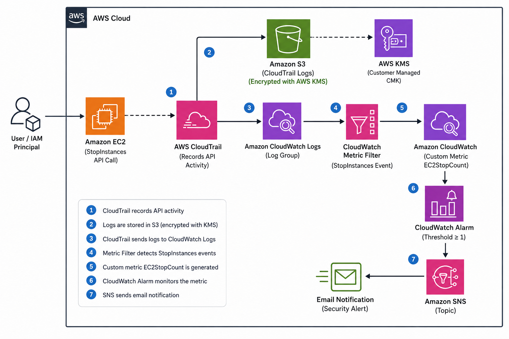
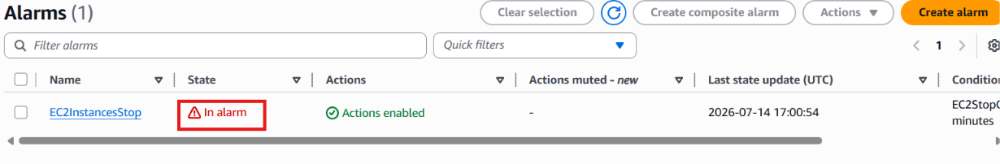
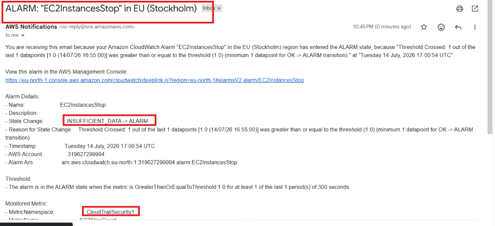

# AWS CloudTrail Security Monitoring Project

## Project Overview

A centralized AWS security monitoring solution that captures AWS API activities using AWS CloudTrail, securely stores encrypted audit logs in Amazon S3 using AWS KMS, monitors events through Amazon CloudWatch, detects EC2 StopInstances API activity using Metric Filters, and sends real-time security alerts through Amazon SNS.

---

## Architecture

---

## AWS Services Used

- **AWS CloudTrail** – Records AWS management API activities
- **Amazon S3** – Secure storage for CloudTrail audit logs
- **AWS KMS** – Encrypts CloudTrail log files
- **Amazon CloudWatch Logs** – Receives and analyzes CloudTrail events
- **CloudWatch Metric Filters** – Detects specific security events
- **CloudWatch Alarms** – Generates alerts based on metrics
- **Amazon SNS** – Sends email notifications
- **Amazon EC2** – Test resource for monitoring

---

## Key Features

- Centralized AWS API activity monitoring
- Encrypted audit log storage
- EC2 StopInstances activity detection
- Automated CloudWatch alerting
- Real-time email notifications

---

## Testing & Results

The solution was tested by performing an EC2 StopInstances API action after configuring the CloudWatch Metric Filter.

Results:

✅ CloudTrail captured the API activity  
✅ CloudWatch Logs received the event  
✅ Metric Filter generated a custom metric  
✅ CloudWatch Alarm entered ALARM state  
✅ SNS delivered an email notification  

### CloudWatch Alarm

### SNS Email Notification

---

## Documentation

Detailed implementation steps, configurations, and screenshots:

[Project Documentation](documentation/AWS-CloudTrail-Security-Monitoring-Project.pdf)

---

## Skills Demonstrated

- AWS CloudTrail
- Amazon S3
- AWS KMS
- Amazon CloudWatch
- CloudWatch Logs
- CloudWatch Metric Filters
- CloudWatch Alarms
- Amazon SNS
- AWS IAM
- AWS Security Monitoring

---

## Future Improvements

- Add more CloudTrail security event detections
- Integrate AWS Security Hub
- Implement automated response workflows
- Deploy infrastructure using Terraform

---

## License

MIT License
